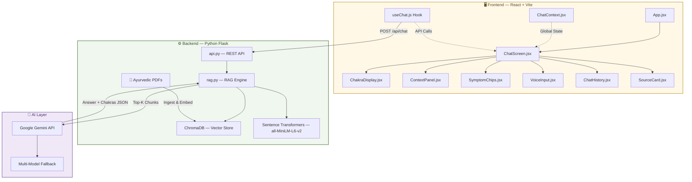
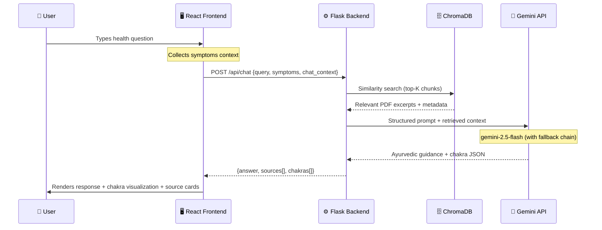

<div align="center">

# 🙏 AI Vaidya

### *Your Ayurvedic AI Consultation Guide*

[](https://python.org)
[](https://react.dev)
[](https://vitejs.dev)
[](https://flask.palletsprojects.com)
[](https://ai.google.dev)
[](https://langchain.com)
[](https://www.trychroma.com)
[](LICENSE)

<br/>

*A RAG-powered Ayurvedic consultation platform that delivers intelligent, research-backed health guidance grounded in traditional Ayurvedic texts and peer-reviewed research — not hallucinations.*

<br/>

[✨ Features](#-features) · [🏗️ Architecture](#%EF%B8%8F-architecture) · [🚀 Quick Start](#-quick-start) · [📡 API Reference](#-api-reference) · [🤝 Contributing](#-contributing)

<br/>

---

</div>

<br/>

## 📸 Screenshots

<div align="center">

| Chat Interface | Chakra Visualization | Source Citations |
|:-:|:-:|:-:|
|  |  |  |

| Symptom Chips | Voice Input | Chat History |
|:-:|:-:|:-:|
|  |  |  |

</div>

<br/>

## ✨ Features

<table>
<tr>
<td width="50%">

### 🧠 RAG-Powered Consultation
Answers are grounded **only** in uploaded Ayurvedic PDFs — zero hallucination. Every response is backed by real source documents with page numbers and relevance scores.

</td>
<td width="50%">

### 🔮 7-Chakra Energy Analysis
Dynamic visualization showing which chakras are blocked or balanced based on your health query — rendered as a beautiful interactive body map.

</td>
</tr>
<tr>
<td>

### 🎯 Smart Symptom Chips
Quick-select common health concerns like *Digestive Issues*, *Stress & Anxiety*, *Joint Pain*, and more — instantly contextualize your consultation.

</td>
<td>

### 🎙️ Voice Input
Speak your health concerns naturally with built-in speech-to-text. Hands-free, accessible, and effortless.

</td>
</tr>
<tr>
<td>

### 📋 Symptom Context Tracking
An active symptoms panel that carries forward your health context across the conversation for more accurate, holistic guidance.

</td>
<td>

### 💬 Persistent Chat History
Your consultations are saved locally via `localStorage` — revisit past conversations anytime without losing context.

</td>
</tr>
<tr>
<td>

### 📑 Source Verification
Every response includes source PDF citations with **page numbers** and **relevance scores** — full transparency, zero guesswork.

</td>
<td>

### 🔄 Multi-Model Fallback
Intelligent cascading: `gemini-2.5-flash` → `gemini-2.0-flash` → `gemini-1.5-flash` → offline extraction. Never fails silently.

</td>
</tr>
<tr>
<td>

### 🙏 Conversational Healer Persona
Responses are styled as a calm, wise Ayurvedic healer — warm and accessible, not cold and academic.

</td>
<td>

### 📱 Responsive Design
Beautifully crafted for desktop and mobile — glassmorphism effects, staggered animations, and micro-interactions on every device.

</td>
</tr>
</table>

<br/>

## 🏗️ Architecture



### 🔄 Request Lifecycle



<br/>

## 📂 Project Structure

```
AI-Vaidya/
│
├── 🔧 BACKEND/
│   ├── api.py                  # Flask REST API server
│   ├── rag.py                  # RAG engine (ChromaDB + Gemini + LangChain)
│   ├── .env                    # GEMINI_API_KEY (not committed)
│   ├── chroma_db/              # Vector database (auto-generated)
│   └── test_rag.py             # Test script
│
├── ⚛️  src/
│   ├── App.jsx                 # Root component
│   ├── main.jsx                # Entry point
│   ├── index.css               # Complete design system (40KB+)
│   │
│   ├── components/
│   │   ├── ChatScreen.jsx      # Main chat interface
│   │   ├── ChatMessage.jsx     # Individual message bubble
│   │   ├── ChakraDisplay.jsx   # 7-chakra visualization
│   │   ├── ContextPanel.jsx    # Active symptoms panel
│   │   ├── SymptomChips.jsx    # Quick-select symptom chips
│   │   ├── InputBox.jsx        # Chat input with send button
│   │   ├── VoiceInput.jsx      # Speech-to-text component
│   │   ├── ChatHistory.jsx     # Sidebar chat history
│   │   ├── SourceCard.jsx      # PDF source citation card
│   │   └── Loader.jsx          # Loading animation
│   │
│   ├── context/
│   │   └── ChatContext.jsx     # Global chat state management
│   │
│   └── hooks/
│       └── useChat.js          # API communication hook
│
├── index.html                  # HTML entry point
├── vite.config.js              # Vite config with API proxy
├── package.json                # Node dependencies
└── README.md                   # You are here ✨
```

<br/>

## 🚀 Quick Start

### Prerequisites

| Requirement | Version | Link |
|:--|:--|:--|
| **Node.js** | 18+ | [nodejs.org](https://nodejs.org) |
| **Python** | 3.10+ | [python.org](https://python.org) |
| **Gemini API Key** | Free tier | [Google AI Studio](https://aistudio.google.com/apikey) |

---

### 1️⃣ Clone the Repository

```bash
git clone https://github.com/your-username/AI-Vaidya.git
cd AI-Vaidya
```

### 2️⃣ Backend Setup

```bash
# Navigate to the backend directory
cd BACKEND

# Install Python dependencies
pip install flask flask-cors langchain langchain-community chromadb sentence-transformers python-dotenv google-genai

# Create your environment file
echo GEMINI_API_KEY=your_api_key_here > .env

# Add your Ayurvedic PDF documents
mkdir pdfs
# Copy your PDF files into the pdfs/ folder

# Start the Flask server
python api.py
```

> [!TIP]
> The server will start on **http://localhost:5000**. On first run, it will automatically ingest your PDFs and build the ChromaDB vector store — this may take a few minutes depending on document size.

### 3️⃣ Frontend Setup

```bash
# Return to project root
cd ..

# Install Node dependencies
npm install

# Start the Vite dev server
npm run dev
```

> [!NOTE]
> The app will be available at **http://localhost:5173**. Vite is configured to proxy `/api` requests to the Flask backend at port 5000.

### 4️⃣ Start Consulting! 🎉

Open [http://localhost:5173](http://localhost:5173) in your browser and ask your first Ayurvedic health question.

<br/>

## 📡 API Reference

### `POST /api/chat`

Send a health query and receive an Ayurvedic consultation response.

**Request Body:**

```json
{
  "query": "I've been experiencing frequent headaches and fatigue",
  "chat_context": [
    { "role": "user", "content": "Previous message..." },
    { "role": "assistant", "content": "Previous response..." }
  ],
  "symptoms": ["headaches", "fatigue", "poor sleep"]
}
```

**Response:**

```json
{
  "answer": "Namaste 🙏 Based on the ancient wisdom of Ayurveda, your symptoms of headaches and fatigue may indicate a Vata-Pitta imbalance...",
  "sources": [
    {
      "document": "charaka_samhita.pdf",
      "page": 42,
      "content": "Relevant excerpt from the text...",
      "relevance_score": 0.89
    }
  ],
  "chakras": [
    { "name": "Sahasrara", "status": "blocked", "energy": 0.3 },
    { "name": "Ajna", "status": "blocked", "energy": 0.4 },
    { "name": "Vishuddha", "status": "balanced", "energy": 0.8 },
    { "name": "Anahata", "status": "balanced", "energy": 0.7 },
    { "name": "Manipura", "status": "balanced", "energy": 0.6 },
    { "name": "Svadhisthana", "status": "balanced", "energy": 0.7 },
    { "name": "Muladhara", "status": "balanced", "energy": 0.8 }
  ]
}
```

| Field | Type | Description |
|:--|:--|:--|
| `answer` | `string` | The Ayurvedic consultation response |
| `sources` | `array` | PDF citations with page numbers and relevance scores |
| `chakras` | `array` | 7-chakra energy analysis for visualization |

---

### `GET /api/health`

Health check endpoint.

**Response:**

```json
{ "status": "ok" }
```

<br/>

## 🛠️ Tech Stack

<table>
<tr>
<th align="center">Layer</th>
<th align="center">Technology</th>
<th align="center">Purpose</th>
</tr>
<tr>
<td><strong>Frontend</strong></td>
<td>React 18 + Vite</td>
<td>Component-based UI with fast HMR</td>
</tr>
<tr>
<td><strong>Styling</strong></td>
<td>Vanilla CSS</td>
<td>Gold/sand Ayurveda theme with glassmorphism</td>
</tr>
<tr>
<td><strong>Typography</strong></td>
<td>Playfair Display + Manrope</td>
<td>Elegant headings + readable body text</td>
</tr>
<tr>
<td><strong>Backend</strong></td>
<td>Python Flask</td>
<td>REST API server</td>
</tr>
<tr>
<td><strong>AI Model</strong></td>
<td>Google Gemini 2.5 Flash</td>
<td>LLM with multi-model fallback chain</td>
</tr>
<tr>
<td><strong>RAG Framework</strong></td>
<td>LangChain</td>
<td>Document loading, splitting, and chain orchestration</td>
</tr>
<tr>
<td><strong>Vector Database</strong></td>
<td>ChromaDB</td>
<td>Persistent vector storage for PDF embeddings</td>
</tr>
<tr>
<td><strong>Embeddings</strong></td>
<td>Sentence Transformers (all-MiniLM-L6-v2)</td>
<td>Lightweight, fast text embeddings</td>
</tr>
</table>

<br/>

## 🎨 Design Philosophy

<div align="center">

| Element | Choice | Inspiration |
|:--|:--|:--|
| 🎨 **Color Palette** | Gold · Sand · Cream · Deep Brown | Ancient Ayurvedic manuscripts |
| ✨ **Effects** | Glassmorphism + subtle gradients | Modern wellness aesthetics |
| 🔤 **Headings** | Playfair Display (serif) | Timeless elegance |
| 📝 **Body Text** | Manrope (sans-serif) | Clean readability |
| 🎭 **Icons** | Material Icons | Consistent visual language |
| 💫 **Animations** | Staggered entrances + micro-interactions | Calm, organic feel |

</div>

<br/>

## 🤝 Contributing

Contributions are welcome and deeply appreciated! Here's how you can help:

1. **Fork** the repository
2. **Create** your feature branch
   ```bash
   git checkout -b feature/amazing-feature
   ```
3. **Commit** your changes
   ```bash
   git commit -m "feat: add amazing feature"
   ```
4. **Push** to the branch
   ```bash
   git push origin feature/amazing-feature
   ```
5. **Open** a Pull Request

### 💡 Contribution Ideas

- 🌿 Add more Ayurvedic PDF sources
- 🌍 Multi-language support (Hindi, Sanskrit, etc.)
- 📊 User health dashboard with historical tracking
- 🧪 Unit and integration tests
- 🎨 Dark mode theme
- 📱 Progressive Web App (PWA) support

<br/>

## ⚠️ Disclaimer

> [!IMPORTANT]
> AI Vaidya is an **educational and informational tool** grounded in traditional Ayurvedic literature. It is **not a substitute for professional medical advice**, diagnosis, or treatment. Always consult a qualified healthcare provider for medical concerns.

<br/>

## 📄 License

This project is licensed under the **MIT License** — see the [LICENSE](LICENSE) file for details.

<br/>

---

<div align="center">

**Built with 🙏 and ancient wisdom**

*"When diet is wrong, medicine is of no use. When diet is correct, medicine is of no need."*
— **Ayurvedic Proverb**

<br/>

<sub>Made with ❤️ for the world's oldest healing science</sub>

</div>
